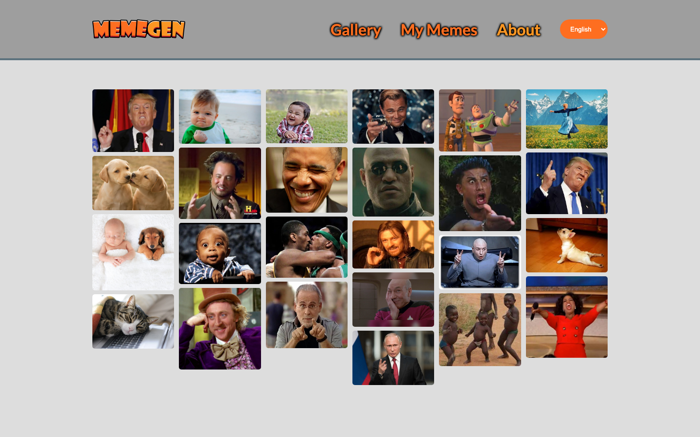
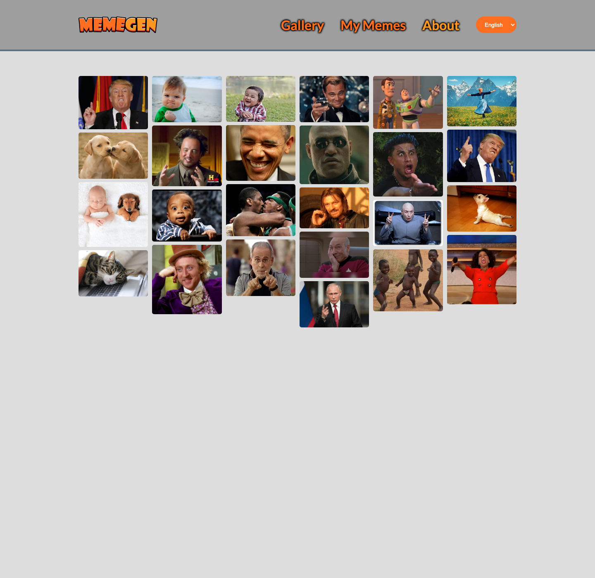
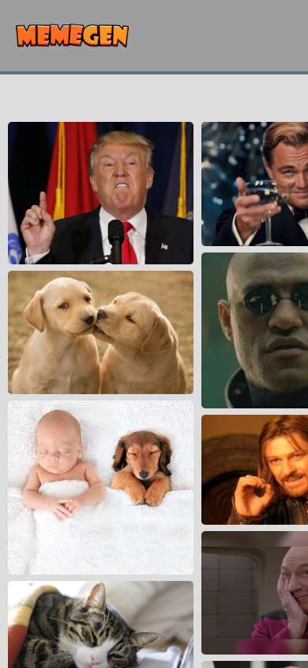

# Meme Generator

A client-side meme maker that lets users choose an image, add and position text, save creations locally, and download the finished meme.

**Live site:** [onchetrit.github.io/on-chetrit-meme-generator](https://onchetrit.github.io/on-chetrit-meme-generator/)

## Highlights

- Choose from a gallery or upload an image.
- Add, edit, and drag text overlays on a canvas.
- Save memes in local storage and export the final image.

## Tech

Vanilla JavaScript, HTML5 Canvas, CSS, and local storage.

## Screenshots

| Desktop | Editor detail | Mobile |
| --- | --- | --- |
|  |  |  |

## Run locally

~~~bash
python3 -m http.server 8080
~~~

Then open http://localhost:8080.
